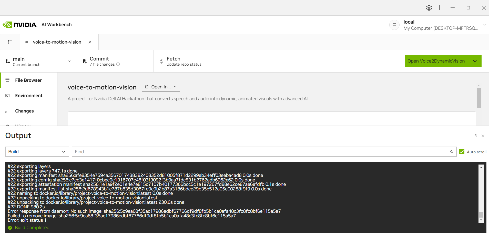

# Speech to Dynamic Image Converter
This project titled **Speech-to-Dynamic Image Converter**, extends the previous **Speech-to-Image Converter** application and aims to generate dynamic motion pictures based on audio or speech as input by leveraging the benefits of Nvidia's AI workbench. The project can be used in various educational, storytelling, and creative content generation applications.

## Features Included
The Speech-to-Dynamic Image Converter application introduces certain enhancements and features over the previous static image generation project, and these enhancements are:

1) **Dynamic Motion Output**: The application generates motion-enhanced images, creating a more immersive visual experience compared to static images.
2) **Advanced Animation Effects**: Adds subtle animations like environmental movements (e.g., rustling leaves, flowing water) or subject motions (e.g., walking animals).
3) **Secure API Key Handling**: In the speech-to-image conversion application, Nvidia's secret API key was hardcoded in the code, however now in this enhanced project the secret key is embedded as part of the environmental variables, eliminating security risks and improving deployment flexibility.
4) **Ease of Use**: Unlike the speech-to-image conversion application where the user was expected to open the Jupyter notepad, execute the code and then open the application. This project integrates the speech-to-dynamic-image converter application directly inside Nvidia's AI workbench. All that the user has to do in the Speech-to-Dynamic-Image converter is open the application directly from the Nvidia AI workbench without needing to execute the program. 

## Description
The Speech-to-Dynamic Image Converter is an advanced generative AI application that creates dynamic motion pictures directly from spoken or audio descriptions. While traditional generative AI systems like speech-to-text, text-to-image, text-to-video, and image-to-video converters are well-established, this project builds upon the concept of [speech-to-image conversion](https://github.com/Raghu-dev-pixel/Nvidia_speech_to_Image_converter.git) by introducing dynamic visuals. This project leverages NVIDIA's AI Workbench and NVIDIA's APIs to convert audio inputs into high-quality motion content seamlessly.

For example, if a user says, **Lion in a Jungle in 4K**, the application transcribes the audio, generates a high-resolution static image based on the transcription, and enhances it with dynamic effects to create a captivating motion picture. This innovative approach offers new possibilities in education, storytelling, and creative content generation.

**Setup and Tools**
The project utilizes NVIDIA AI Workbench, a platform that simplifies GPU workstation setup, enabling developers to work across different hardware environments seamlessly. It ensures that even users without a local GPU can run the application effectively.

**Architecture Overview**
The system architecture is divided into three key modules:

1) **Speech-to-Text Conversion**
This module leverages OpenAI's Whisper model to transcribe spoken audio into text. Whisper's ability to handle various languages and noisy environments makes it ideal for this task, ensuring that the application is not limited to specific languages or pristine audio quality.
* **Device Optimization**: The system detects whether a GPU is available and automatically uses it for faster processing, otherwise defaulting to the CPU.
* **Processing**: The ASR model processes audio files in 30-second chunks to ensure efficient handling, providing the transcribed text as input to the next module.

2) **Text-to-Image Conversion**
This module generates images from the text output using NVIDIA's Stable Diffusion AI model.
* **API Integration**: The module communicates with NVIDIA's GenAI Stable Diffusion API. The transcribed text is sent to the API along with configurable parameters such as sampling method, quality scaling, random seed, and processing steps.
* **Image Generation**: The API responds with the generated image in base64 format. This data is decoded and processed and the generated static image is then used to create a dynamic image with motion effects. 

3) **Image-to-Motion-Image**
This module enhances the static image by adding motion effects to create a dynamic image/video output using NVIDIA's Stable Video Diffusion AI.
* **API Usage**: This module interacts with NVIDIA’s Stable Video Diffusion API, leveraging the same secure API key. The static image, encoded in base64 format, is provided as input to the API.
* **Motion Effects**: The above API returns the video which is base64-encoded, which is then decoded into binary format, and saved as a .mp4 file for playback using the gradio application. 

**Key Benefits**
1) **Cross-Platform Compatibility**: The application can be run with or without a local GPU, thanks to NVIDIA’s cloud-based APIs.
2) **Language Independence**: The system supports multiple languages for audio input, making it versatile and accessible to a global audience.
3) **Efficient Processing**: By leveraging pre-trained models from NVIDIA's API, the application avoids the need for local model training, ensuring faster image generation.
4) **Ease of Use**: The use of NVIDIA AI Workbench ensures that the project can be easily cloned and run across different platforms, making it accessible to users with diverse hardware setups.

This speech-to-image converter redefines the creative process, enabling users to generate visuals directly from spoken descriptions, whether for design, education, or storytelling purposes.

## Getting Started
The Speech-to-Dynamic-Image Converter application can be used by following a few simple steps described below:
1) **Installation**: Install [Nvidia's AI workbench](https://www.nvidia.com/en-us/deep-learning-ai/solutions/data-science/workbench/). To make use of AI workbench it is also necessary to have [Docker Desktop](https://docs.docker.com/desktop/install/windows-install/) installed.

2) **Cloning the Project**:
* Once the Nvidia AI workbench and docker desktop have been installed successfully, open the AI workbench and choose the location where the project needs to be executed, it can either be local or remote as shown .
* Once the location to execute the project has been selected, there are two options. Either a new project can be created or clone an already existing project and since we already have our project in GitHub, we can clone the [speech to dynamic-image converter application project](https://github.com/Raghu-dev-pixel/voice-to-motion-vision.git) and then click on the clone option..
* Once the project is cloned, the project starts building automatically, allow the build to complete.

3) **Starting the Application**:
* After the build is successful, click on the "Open Voice2DynamicVision" icon on the top right-hand corner of the AI workbench. .
* Wait for a few seconds and then you will be redirected to the application on the installed web-browser.
  
4) **Using the Speech-to-Image-Converter Application**:
* Play around with the application, with different audio inputs to discover the dynamic visuals generated by the system.
* The application supports direct speech input from the user if access to a microphone is allowed by the user and it is also possible to upload recorded audio files. At the output, we get a realistic visual of what has been said in the audio input and this application also supports multiple languages.
* For instance in our example, the user says "Lion in a Jungle in 4K" and the application outputs, a motion-enhanced visual of a Lion in a jungle setting 
  .
* The motion-enhanced visual would appear as shown below.
  .

## Requirements
The project and the application were tested under the specifications mentioned below:
* Operating system: Ubuntu 20.04
* CPU requirements: None, tested with Intel ®Xeon® Platinum 830 CPU @2.30GHz.
* GPU Used: Tesla T4. However, it also works for other GPUs, provided all the latest drivers are installed.
* Storage requirements: 40GB

## What's Unique
The Speech-to-Dynamic Image Converter application builds upon the basis of the previous Speech-to-Image Converter by introducing innovative features and addressing key feedback points to create a differentiated and impactful solution. Unlike traditional solutions focused on static image generation, this project seamlessly integrates speech-to-text transcription, static image creation, and dynamic video generation into a unified pipeline. The addition of motion effects to images makes it a unique tool for immersive storytelling and advanced content creation. Some of the versatile applications where this application can be used are as follows:
1) **Academics**: It is possible to create motion-enhanced animations to explain complex concepts interactively. For instance, “The life cycle of a butterfly” can generate a dynamic visualization of the process.
2) **Healthcare**: we can produce dynamic anatomical models based on medical descriptions for better understanding and training.
3) **Entertainment**: The Speech-to-Dynamic Image Converter can also be used in the entertainment industry by enabling creators to generate motion-enhanced visuals from narrated descriptions, streamlining content production for movies.

## Further Improvements
The following ideas can be thought of for further improvement.
* Currently we are using Nvidia's API from the catalog to generate an image from text, instead of doing that it would also be nice to train and use stable diffusion model and video stable diffusion APIs directly, with this approach we could also generate dynamic visuals of ourselves. For example "Raghu in space" would then give an image of myself in space.
* The idea could further be extended for generating 3D visuals, based on audio inputs.
* We could also try to create cartoons and other animations.

## Aditional Information
Since we are using NVIDIA's API for stable diffusion to convert text to image, it is essential to have an API key generated. The API key can be generated using the below steps:
1) Login to the [Nvidia NGC catalog](https://catalog.ngc.nvidia.com/?filters=&orderBy=weightPopularDESC&query=&page=&pageSize=) and login with your email ID.
2) Create your account, and give an account name of your choice, and select "Create Nvidia Cloud Account".
3) Fill in all your details and click on the submit button.
4) Once you have your account created, login to the NGC account with your email and click on your email account at the right-hand top corner, and then select the setup option.
5) Select the "Generate Personal Key" from the menu and then again click on the "Generate Personal key" at the middle of the page.
6) Once this is done copy the personal key that is generated and save it in your notepad after which we can sign out from the account.

Note:- The above-mentioned steps for API creation are not needed for the moment as I have created my key from my account explicitly created for this demo purpose, however, if the application does not work right away as described earlier this is one option that could be checked.

The presentation for this project can be found in [Download the presentation](./data/HackAI_ppt.pptx).